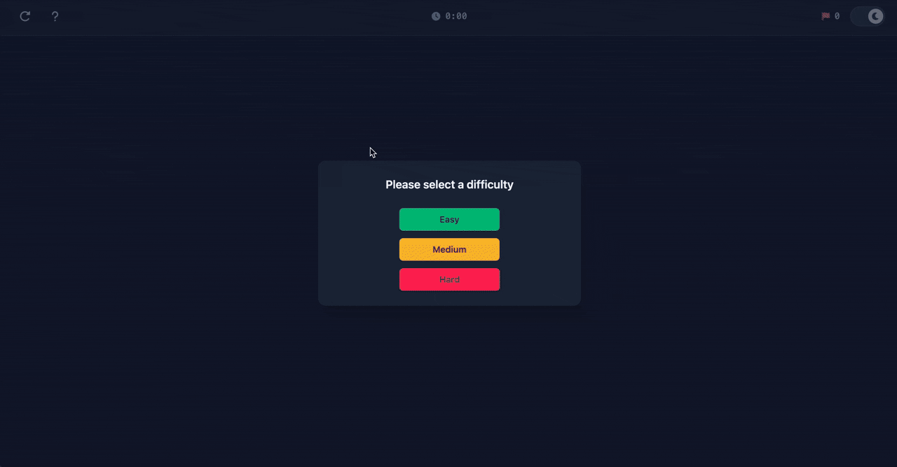

# Minesweeper

A cozy, modern take on a classic. Built to feel fast and satisfying on both desktop and mobile, with a board generator that tries really hard to give you a solvable game. The funny part: I first learned about Minesweeper during a job interview when I was asked to implement its backend logic. I passed, got addicted, and eventually decided to make a clean version of my own. Try it [here](https://w29ahmed.github.io/minesweeper)!

<div align="center">
  
</div>

### What Makes It Special

- **Solvable board generation**: A time‑budgeted solver + mutation search that aims for boards you can reason through (not just guess).
- **Responsive UI**: The board size adapts to your screen and difficulty choice.
- **Delightful feedback**: Subtle animations, penalties for mistakes, and helpful hints.

### Solvable Board Algorithm

Curious how the board is generated? See **[solvable_board_algorithm.md](./solvable_board_algorithm.md)** for a detailed explanation.

### Built With

- [Svelte](https://svelte.dev): A modern JavaScript framework for building fast, reactive web interfaces
- [Tailwind CSS](https://tailwindcss.com): Utility-first CSS framework for rapid UI development
- Icons from [Font Awesome](https://fontawesome.com)
- Hosted with [GitHub Pages](https://pages.github.com)

### Development

You’ll need [Node.js](https://nodejs.org/en) installed (npm comes with it).
For best results, use the version in [.nvmrc](.nvmrc). (`24.12.0`)

```
npm install
npm run dev
```

### Deploy

```
npm run build
npm run deploy
```
