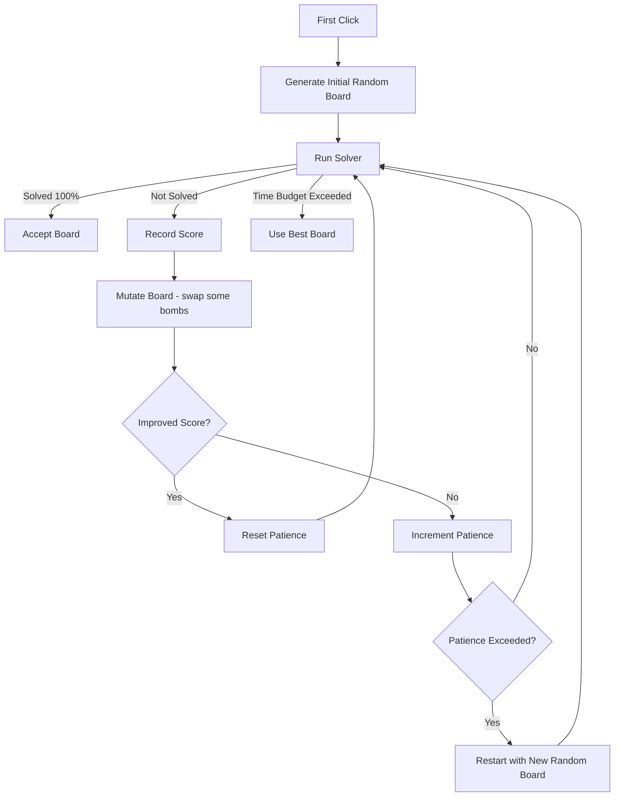

# Solvable Board Algorithm

This document explains how Minesweeper boards are generated so they are **as solvable as possible without guessing**, while still running fast enough for a smooth UX.

The implementation lives in `src/lib/generate_solveable_board.ts` and is invoked when a new game starts (after the first click, so the initial cell is guaranteed safe).

---

## High‑Level Idea

We generate **many candidate boards** within a strict time budget, run a **solver** on each, and keep the **best result**:

- If we find a **fully solvable** board, we use it immediately.
- If time runs out, we keep the **most‑solvable** board (the one that solved the most safe cells before a guess would be required).

To make this efficient, we use a **mutation search** approach instead of only random boards:

1. Start with a random board (excluding the first click and its neighbors).
2. Run the solver.
3. If it’s not solvable, **mutate** the board by swapping a small percentage of bombs in unrevealed cells.
4. Try again, keeping improvements and restarting after too many non‑improving mutations.

---

## UML Flow



---

## Solver Rules

The solver is intentionally lightweight, but surprisingly effective:

### 1) Basic Deduction Rules

For each revealed cell:

- If the number equals the count of **unrevealed neighbors**, all those neighbors must be bombs.
- If the number equals the count of **flagged neighbors**, all other unrevealed neighbors are safe to reveal.

### 2) Subset Rule (Advanced, But Cheap)

If basic rules stall, the solver checks **frontier pairs** (neighboring revealed cells that share unrevealed neighbors). In plain English:

- If one revealed cell’s unknown neighbors are a **subset** of another’s, then the difference between them can be inferred.

This often unlocks deductions without brute force.

---

## Mutation Search Strategy

When the solver stalls before solving the full board:

1. Copy the current board.
2. Randomly **swap a small percentage of bombs** with safe cells, but only in **unrevealed** regions.
3. Keep the **first‑click safe zone** intact (the clicked cell + its 8 neighbors).
4. Run the solver again.

If a mutation improves the solve score, we keep it and reset the patience counter. If not, we increment patience. When patience is exhausted, we **restart from a new random board** to escape local minima.

---

## Key Parameters

| Parameter             | Default | Purpose                                         |
| --------------------- | ------- | ----------------------------------------------- |
| `timeBudgetMs`        | `250`   | Hard cap on generation time                     |
| `mutationSwapPercent` | `3`     | % of bombs to swap each mutation                |
| `mutationPatience`    | `100`   | How many non‑improving mutations before restart |

---

## Output Selection

At the end of the time budget:

- If a fully solvable board was found → **use it**.
- Otherwise → **use the best scored board** (highest number of safe reveals before a guess).

---

## Debug Logging

If you enable the `debug` option, the generator prints a concise JSON summary to the console each run (attempts, elapsed time, percent solved, and whether it picked a solved or best board). This makes it easy to inspect solver performance while tuning parameters. `debug` is automatically enabled when running locally with `npm run dev`.

Example output:

```text
# easy
[minesweeper] generateSolvableBoard {"rows":13,"cols":27,"bombs":53,"selection":"solved","score":351,"percentSolved":100,"attempts":1,"selectionAttempt":1,"timeBudgetMs":250,"elapsedMs":13}

# medium
[minesweeper] generateSolvableBoard {"rows":16,"cols":34,"bombs":109,"selection":"solved","score":544,"percentSolved":100,"attempts":101,"selectionAttempt":101,"timeBudgetMs":250,"elapsedMs":171}

# hard
[minesweeper] generateSolvableBoard {"rows":20,"cols":40,"bombs":224,"selection":"best","score":687,"percentSolved":85.9,"attempts":194,"selectionAttempt":163,"timeBudgetMs":250,"elapsedMs":250}
```

In this snapshot, easy/medium finished within the budget and returned a fully solvable board (`selection: "solved"`).
Hard hit the 250ms time budget, so it returned the best‑scoring board it found (`selection: "best"`), trading a small amount of solvability for a snappy first click.

---

## Why This Works

This approach balances **fast generation** with **playable boards**:

- It doesn’t brute force endlessly.
- It avoids heavy SAT solvers.
- It still tries to deliver a board you can solve logically.

If you want to tweak the behavior, the parameters above are designed to be easy to tune.
